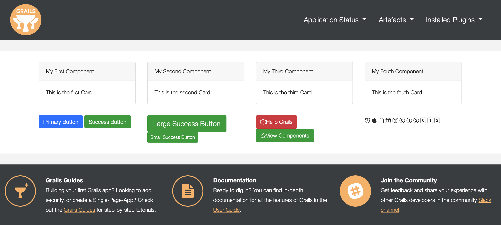

# Grails View Components Demo

A Grails plugin for creating reusable, testable and encapsulated view components.



## Grails Version

- Grails **4.1.2**

## Usage

### Adding `grails-plugin-view-components`

Adding `grails-plugin-view-components` plugin to the `build.gradle`,

```gradle
buildscript {
    repositories {
        maven { url "https://repo.grails.org/grails/core" }
    }
    dependencies {
        classpath "org.grails:grails-gradle-plugin:$grailsVersion"
        classpath "org.grails.plugins:views-gradle:2.0.4" // In Grails 5: using 2.3.2
    }
}

apply plugin: "org.grails.grails-gsp"
apply plugin: "org.grails.plugins.views-markup" // Need to build Grails Markup Views

repositories {
    mavenCentral()
}

dependencies {

    // Grails 4
    compile "org.rainboyan.plugins:grails-plugin-view-components:0.0.1"

    // Grails 5
    implementation "org.rainboyan.plugins:grails-plugin-view-components:0.0.1"
}

```

Let's start create some Components, `ButtonComponent` in `grails-app/components`,

```bash
.
├── grails-app
│   ├── assets
│   ├── components
│   │   └── demo
│   │       ├── ButtonComponent.groovy
│   │       └── CardComponent.groovy
│   └── views
│       └── components
│           ├── button
│           │   └── button_component.gml
│           └── card
│               └── card_component.gml

```

`ButtonComponent` is just a POGO, we define attribues which will be used in Markup views.

```groovy
class ButtonComponent {
    String name = 'Button'
    String type = 'button'
    String size
    String cssClasses
    String color
    String state
    String icon

    String getCssClasses() {
        String theCssClasses = 'btn'
        if (this.cssClasses) {
            theCssClasses += ' ' + this.cssClasses
        }
        else {
            theCssClasses += " btn-info"
        }
        if (size) {
            theCssClasses += " btn-$size"
        }
        theCssClasses
    }
}
```

In the `grails-app/views/components/button/button_component.gml`,

```html
model {
    String name
    String type
    String size
    String cssClasses
    String color
    String state
    String icon
}

button([type: type, class: cssClasses] + (state == 'disabled' ? [disabled : ''] : [:]) + (color ? [style: 'color: ' + color] : [:])) {
    if (icon) {
        i(class: "bi bi-${icon}") {
        }
    }
    yield name
}
```

Using the `ButtonComponent`, `CardComponent` in your GSPs, it's very easy, `ViewComponents` support custom namespace and tags.

```html

// Using expression in GSP
${new ButtonComponent(name: 'Primary Button', cssClasses: 'btn-primary').render()}

// Using tag in GSP
<vc:render component="button" name="View Components" cssClasses="btn-success" icon="star" />

// Custom namespace tags not support yet
<vc:button type="button" name="Icon Button" cssClasses="btn-primary" icon="box" />

<vc:card title="My First Component" content="This is the first Card" />

<g:each var="post" in="${Post.list()}">
    <vc:card title="${post.title}" content="${post.body}" />
    // or
    <vc:card model="${post}" />
</g:each>

<vc:icon name="alarm" />
<vc:icon name="apple" />
<vc:icon name="bag" />
<vc:icon name="bank" />
<vc:icon name="box" />

```

### Using Inline template

You also can write template in Component groovy source using `inline(String templateText)`, it's One File Component!

```groovy
class IconComponent {
    String name

    def render() {
        inline """
i(class: "bi bi-$name") {
}
"""
    }
}
```


## Known issues

Currently, Grails GSP Taglib does not support Custom Namespace like `tmp`, `link`, but I have already submit a feature request: [Support custom namespace when invoking TagLib of GroovyPage](https://github.com/grails/grails-gsp/issues/324) and I will implement this feature later, I really hope that the framework will support this feature. If you are interested in this feature, you can join the discussion and leave a comment to post ideas.


## License

This plugin is available as open source under the terms of the [APACHE LICENSE, VERSION 2.0](http://apache.org/Licenses/LICENSE-2.0)


## Links

- [Grails](https://grails.org)
- [Grails Github](https://github.com/grails)
- [Grails Views](http://views.grails.org/latest/)
- [Grails View Components Plugin](https://github.com/rainboyan/grails-plugin-view-components)
